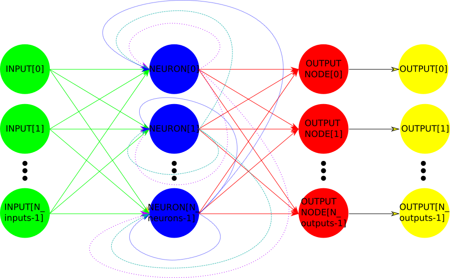

# Neural-Networks
* generic neural network stub
* training using genetic algorythm

## Structure

Neural network consists of at least one input, at least one neuron, and one or more output nodes. Each neuron gets values of network inputs and output value from each of the neurons (also from it self) and calculates new output value. Each of the ouput nodes gets output value from each of the neurons and translates calculated result to the corresponding network output.

